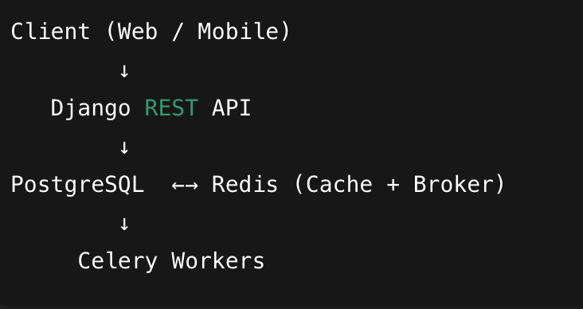
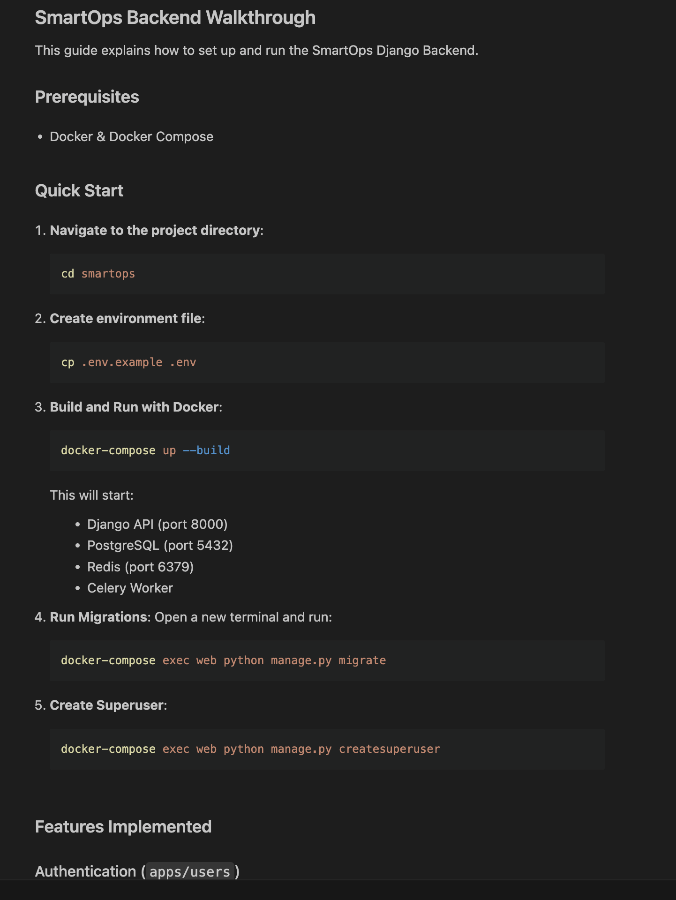
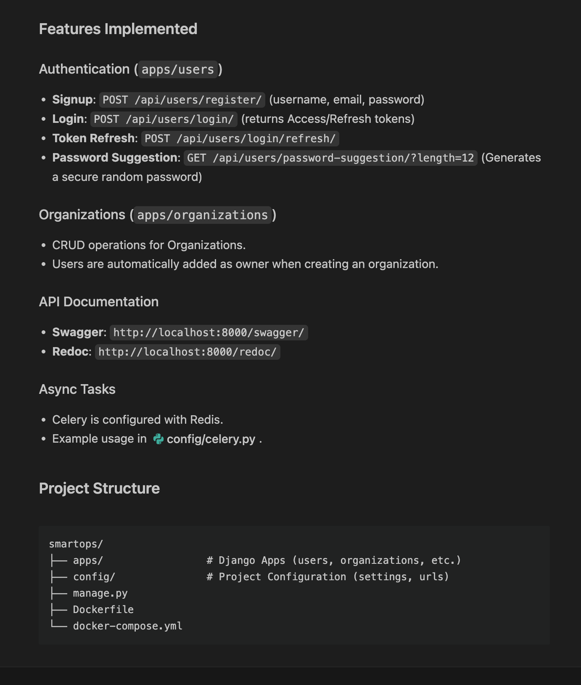
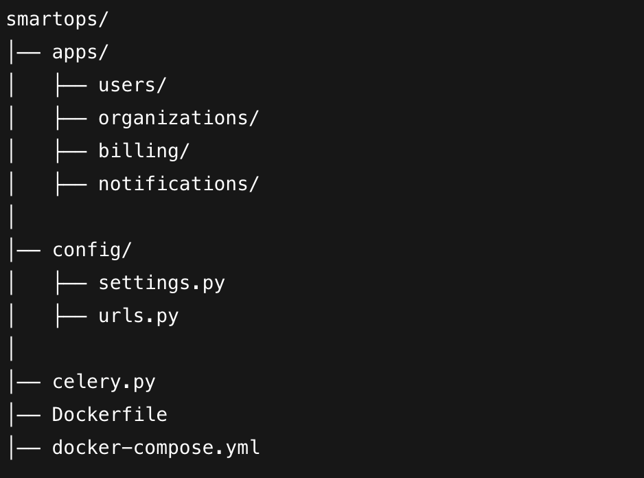
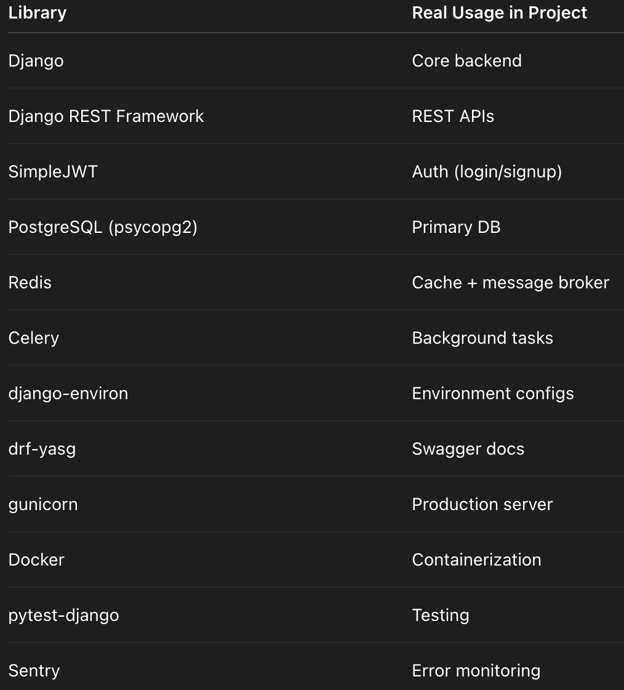

# SmartOps

SmartOps is a production-ready Django backend designed for SaaS applications. It provides a robust foundation with authentication, asynchronous task processing, and a scalable architecture.

## System Architecture

The following diagram illustrates the high-level system architecture of SmartOps:



## Features & Previews

SmartOps comes equipped with essential features for modern SaaS platforms.

### Operational Usage


*Dashboard Overview*


*Detailed View*

## Project Structure

The project follows a modular Django app structure to ensure maintainability and scalability.



## Libraries & Technology Stack

We leverage a modern stack of libraries and tools to deliver performance and reliability.



## Getting Started

### Prerequisites

- Docker
- Docker Compose

### Installation

1.  **Clone the repository**

    ```bash
    git clone <repository-url>
    cd smartops
    ```

2.  **Environment Setup**

    Copy the example environment file:

    ```bash
    cp .env.example .env
    ```

3.  **Run with Docker Compose**

    Build and start the services:

    ```bash
    docker-compose up --build
    ```

    The application will be available at `http://localhost:8000`.

### Services

-   **Web**: Django application (Port 8000)
-   **DB**: PostgreSQL 15 (Port 5432)
-   **Redis**: Redis 6 (Port 6379, used as broker for Celery)
-   **Worker**: Celery worker for asynchronous tasks
# SmartOps
